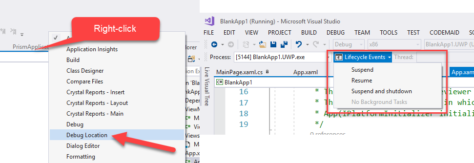

# Application Lifecycle Management
Mobile applications development has to deal with the concept of __application lifecycle__. With this we mean that mobile apps are created to manage scenarios where battery life, CPU and memory are limited (as opposed to the classic desktop app where all of this is unlimited).

When a mobile app is running in backgroud it is __suspended__ by the OS after a few seconds. The exact timing is different from OS to OS and other factors. When the application is suspended it is frozen: the app will continue to use memory but all the running operations are stopped. This way, every other application can make use of resources. However RAM isn't infinite and the app will be __killed__ by the OS to free some memory if necessary.

As mobile developers you need to take care of this to provide your users a smooth and transparent experience whenever possible and restore the previous state of the app.

The typical application lifecycle events are:
+ __Initializing__. This happens the first time the app is launched.
+ __Resuming__. This happens every time we restore the app from the background after it has been suspended.
+ __Sleeping__. This happens when the OS decides to freeze our app after it has gone in background.

The management of these events can be tricky in an MVVM app but Prism provides the [IApplicationLifecycleAware](https://github.com/PrismLibrary/Prism/blob/master/Source/Xamarin/Prism.Forms/AppModel/IApplicationLifecycleAware.cs) interface to make your life easier.


## How to handle ALM in your ViewModels
The first thing you have to do to is to implement the `IApplicationLifecycleAware` interface in your __ViewModel__ class. Implemening this interface means that you have to provide an implementation of the `OnResume()` and `OnSleep()` method that are called by the framework when the app is resuming and going to sleep respectively. The typical operation you'll do in the `OnSleep()` method is to __save__ the state of your ViewModel to later __restore__ it during the execution of the `OnResume()` method.

The following is an example of a ViewModel that implements `IApplicationLifecycleAware`.

```csharp
public class ViewModelExample : ViewModelBase, IApplicationLifecycleAware
{
    protected INavigationService NavigationService { get; }

    public ViewModelExample(INavigationService navigationService)
    {
        NavigationService = navigationService;
    }

    public void OnResume()
    {
        //Restore the state of your ViewModel.
    }

    public  void OnSleep()
    {
        //Save the state of your ViewModel.
    }
}
```

## How to handle ALM at Application level
You can handle ALM events at the __Application__ level by overriding the `OnSleep()` and `OnResume()` methods in the `App` class.
The following is an example of an `App` class with ALM management.

```csharp
public partial class App : PrismApplication
{

    public App() : this(null) { }

    public App(IPlatformInitializer initializer) : base(initializer) { }

    protected override async void OnInitialized()
    {
        InitializeComponent();

        var result = await NavigationService.NavigateAsync("NavigationPage/MainPage");
    }

    protected override void RegisterTypes(IContainerRegistry containerRegistry)
    {
        containerRegistry.RegisterForNavigation<NavigationPage>();
        containerRegistry.RegisterForNavigation<MainPage>();
    }

    protected override void OnResume()
    {
        base.OnResume();

        // TODO: Refresh network data, perform UI updates, and reacquire resources like cameras, I/O devices, etc.
    }

    protected override void OnSleep()
    {
        base.OnSleep();

        // TODO: This is the time to save app data in case the process is terminated.
        // This is the perfect timing to release exclusive resources (camera, I/O devices, etc...)
    }
}
```

## Handling app resume and suspend
In general, an application goes into __sleep mode__ when it no longer commands the screen and has become inactive. From this sleep mode, an application can be __resumed__ (signaled by an `OnResume()` call) or __terminated__. But this is important: after the `OnSleep()` call, there is __no further notification__ that an application is being terminated. The `OnSleep()` call is as close as you get to a termination notification, and it always precedes a termination. For example, if your application is running and the user turns off the phone, the application gets an `OnSleep()` call as the phone is shutting down. If your program has established a connection with a web service, or is in the process of establishing such a connection, you might want to use `OnResume()` to restore that connection. Perhaps the connection has timed out in the interval that the program was inactive. Or perhaps some fresh data is available.


## Debugging tips and tricks
When your app is attached to the Visual Studio debugger, it will not be suspended. You can suspend it from the debugger, however, and then send it a Resume event so that you can debug your code. Make sure the Debug Location toolbar is visible and click the drop-down next to the Suspend icon. Then choose Resume.



## Reference
+ [Xamarin Docs App Lifecycle](https://docs.microsoft.com/en-us/xamarin/xamarin-forms/app-fundamentals/app-lifecycle)

+ [Xamarin Forms Book](https://xamarin.azureedge.net/developer/xamarin-forms-book/XamarinFormsBook-Ch06-Apr2016.pdf)

+ [PrismApplicationBase source code](https://github.com/PrismLibrary/Prism/blob/36dc541274edb3e1d1ee2957e1ae65aafbf6c0a1/Source/Xamarin/Prism.Forms/PrismApplicationBase.cs)
